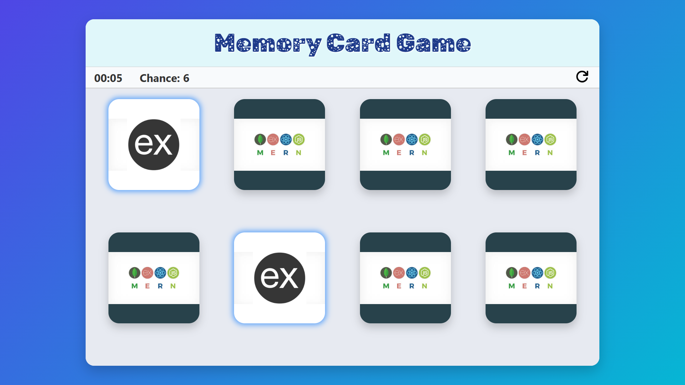

# Memory Card Game 🎴

A fun and interactive **Memory Card Game** where players try to find matching pairs of cards as fast as possible. Built using **HTML**, **CSS**, **JavaScript**, and **Responsive Design**.

---

## Features ✨

- Flip cards to find matching pairs.
- Real-time **timer** to track game duration.
- **Chance counter** to track attempts.
- **Restart and Replay** buttons.
- Responsive design: works on **mobile, tablet, and desktop**.
- Smooth animations and interactive UI.

---

## Demo 🖥️



---

## Installation 🚀

1. Clone the repository:

```bash
git clone https://github.com/yourusername/memory-card-game.git
cd memory-card-game
```

2. Open the `index.html` file in your preferred browser.

3. Start playing the game!

---

## Folder Structure 📂

```
memory-card/
│
├── index.html           # Main HTML file
├── style.css            # Main styles
├── responsive.css       # Responsive styles
├── script.js            # Game logic
└── assets/              # Images and icons
    ├── mongoDB.png
    ├── express.png
    ├── react.png
    ├── node.png
    └── refresh.svg
```

---

## How to Play 🎮

1. Click on any card to flip it.
2. Try to find its matching pair.
3. If two cards match, they stay flipped.
4. If they don't match, they flip back.
5. Game ends when all pairs are found.
6. Use the **Restart** button to play again.

---

## Technologies 🛠️

- HTML5
- CSS3 (Flexbox, Grid, Animations)
- JavaScript (DOM Manipulation)
- Google Fonts: Rubik Distressed & Rubik Moonrocks
- Responsive design with media queries

---

## Customization ⚙️

- Change card images in the `assets` folder.
- Adjust grid columns and card size in `style.css` for different screen sizes.
- Modify timer or game rules in `script.js`.

---

## Author ✍️

**Pranav Gupta**  

- GitHub: [https://github.com/zero9179](https://github.com/zero9179)  

